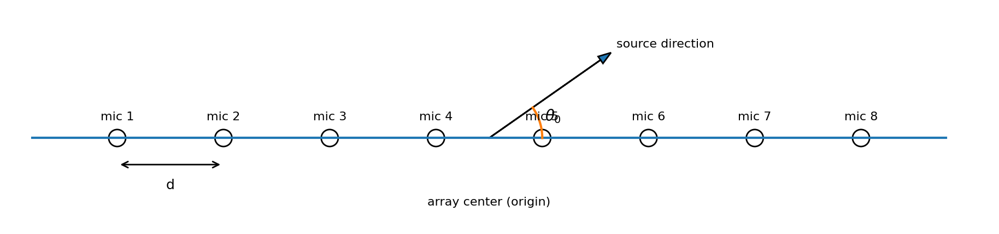
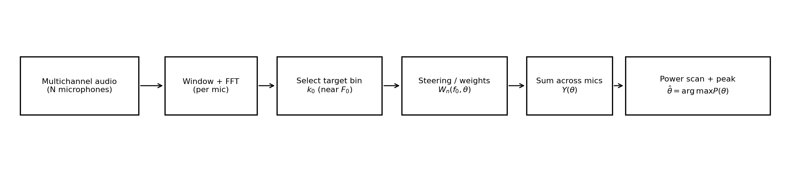
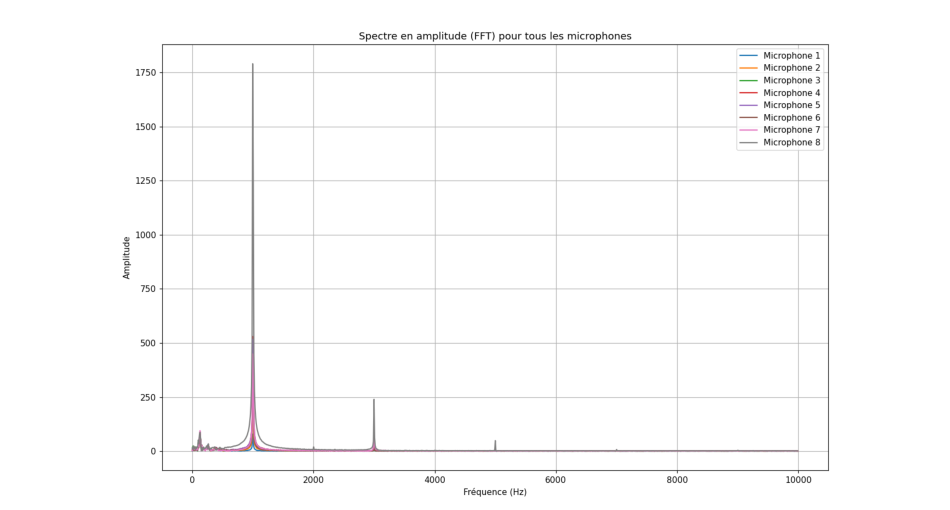
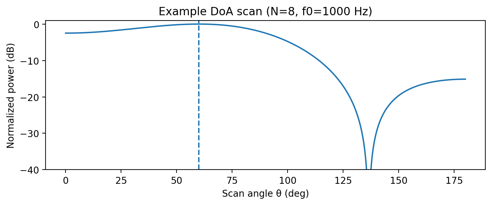
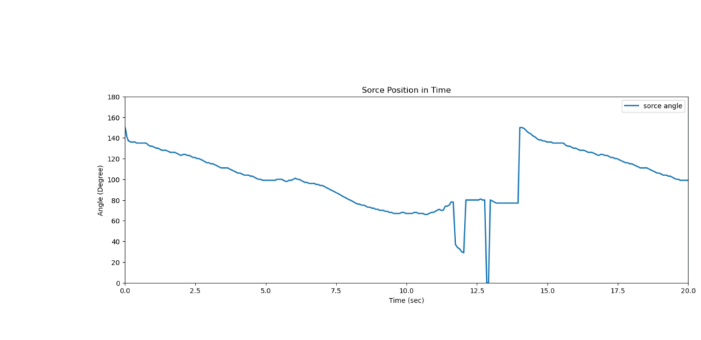

# Microphone Array Beamforming for Sound Source Localization (DoA)

A practical **DSP + array signal processing** project: estimate the **direction of arrival (DoA)** of a narrowband sound source using **frequency‑domain delay‑and‑sum beamforming** on an **8‑microphone linear array** (omnidirectional MEMS).
Sampling rate and FFT frame size used in the experiments: **Fs = 20 kHz**, **BLK = 2048**. 

<p align="center">
  
</p>

---

## What this repo demonstrates

- Multichannel audio handling (8 channels)
- FFT-based narrowband feature extraction (select the bin near a target tone)
- Array geometry + steering/weight design
- DoA scanning (power vs angle) + peak picking
- Practical interpretation: reflections, calibration mismatch, and spatial aliasing effects

<p align="center">
  
</p>

---

## Beamforming math (core equations)

### 1) Microphone positions (linear array)

For **N** microphones equally spaced by **d** along the x‑axis, a common symmetric convention (origin at the array center) is:

$$
x_n = \left(n - \frac{N-1}{2}\right)\,d,\qquad n=0,1,\dots,N-1
$$

In the associated report, the positions are written in the form:

$$
x_n = \left(n - \frac{N}{2}\right)\,d
$$

(That choice corresponds to a slightly different origin/indexing convention for an even number of microphones.)

### 2) Frequency-domain steering / beamforming weights

For a plane wave at frequency **f** and focusing direction **θ₀**, the frequency response (steering weight) for microphone **n** is:

$$
W_n(f,\theta_0) = e^{j\,2\pi \frac{f}{c}\,x_n \cos(\theta_0)}
$$

where **c** is the speed of sound in air. 

### 3) FFT (per microphone)

Given a time buffer \(m(t)\) of length **BLK**, the FFT component at bin \(k\) is:

$$
M_{\mathrm{fft}}(k) = \sum_{t=0}^{\mathrm{BLK}-1} m(t)\,e^{-j2\pi kt/\mathrm{BLK}}
$$ 

### 4) Target bin selection (narrowband tone)

For a known target tone frequency $F_0$, we pick the FFT bin index $k_0$ whose positive-frequency value is closest to $F_0$:

$$
k_0=\arg\min_{0\le k\le \lfloor \text{BLK}/2\rfloor}\left|f_k - F_0\right|
$$

and the exact FFT-bin frequency is:

$$
f_{k_0} = \frac{k_0 F_s}{\text{BLK}}
$$

### 5) Beamformer output + DoA estimate

Let $X_n(f_{k_0})$ be the complex FFT value of microphone $n$ at bin $k_0$.
For a scan direction $\theta$, the beamformer output is:


$$
Y(\theta) = \sum_{n=1}^{N} W_n(f_{k_0},\theta)\,X_n(f_{k_0})
$$

and the normalized power is:

$$
P(\theta) = |Y(\theta)|^2,\qquad \hat{\theta} = \arg\max_{\theta} P(\theta)
$$

For the “mobile source” experiment, the scan is performed over angles \(j \in [0,360]\) and the estimate is the maximum-power angle. 

---

## Figures (from the experiments)

### FFT peak at ~1 kHz (all microphones)

<p align="center">
  
</p>

### Example DoA scan (illustration)

<p align="center">
  
</p>

### Tracking a moving source (estimated angle vs time)

<p align="center">
  
</p>

---

## Example numeric snapshot (1 kHz tone)

In the report, a 1 kHz tone was processed by selecting \(k_0=102\), giving an exact bin frequency close to 1 kHz (**996.09375 Hz**). 

| Mic | FFT amplitude | FFT phase (rad) |
|---:|--------------:|----------------:|
| 1 | 78.620 | -2.024 |
| 2 | 239.836 | -1.368 |
| 3 | 419.630 | -1.114 |
| 4 | 529.760 | -0.910 |
| 5 | 516.788 | -0.597 |
| 6 | 338.894 | 0.006 |
| 7 | 448.906 | 1.724 |
| 8 | 1790.644 | 2.605 |


---

## Repository layout (suggested)

```
.
├── README.md
├── assets/                 # images used in this README
├── docs/
│   └── report.pdf          # the original report / write-up
```

---

## Notes (engineering reality)

- **Directivity improves with frequency** for a fixed array aperture, but high frequencies can show artifacts (e.g., spatial aliasing) if spacing is too large relative to wavelength. 
- In real rooms, **reflections** and **calibration mismatch** can introduce secondary peaks or bias in the DoA estimate. 

---

## Credits

Based on the lab work and report **“Localisation de source sonore avec un réseau de microphones : Approches de beamforming”** (Sorbonne Université, 2024–2025). 
